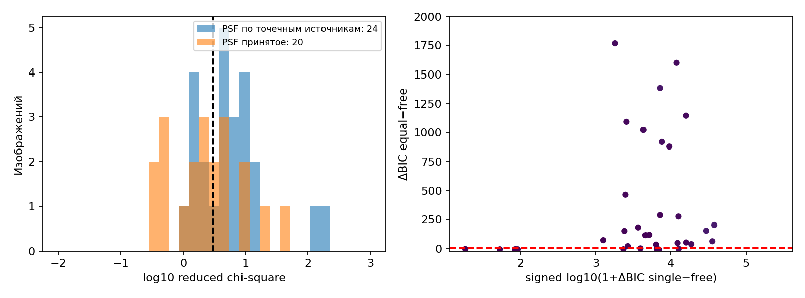
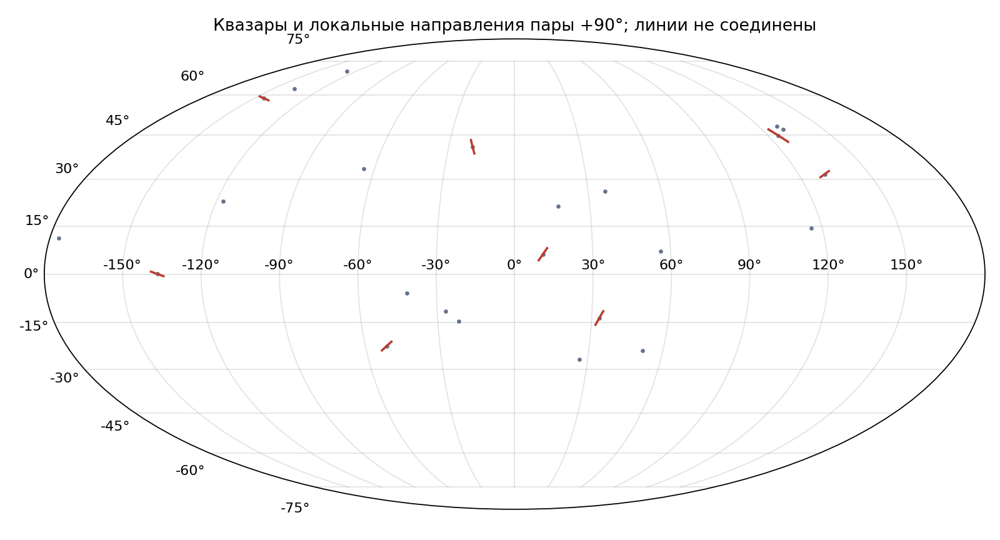
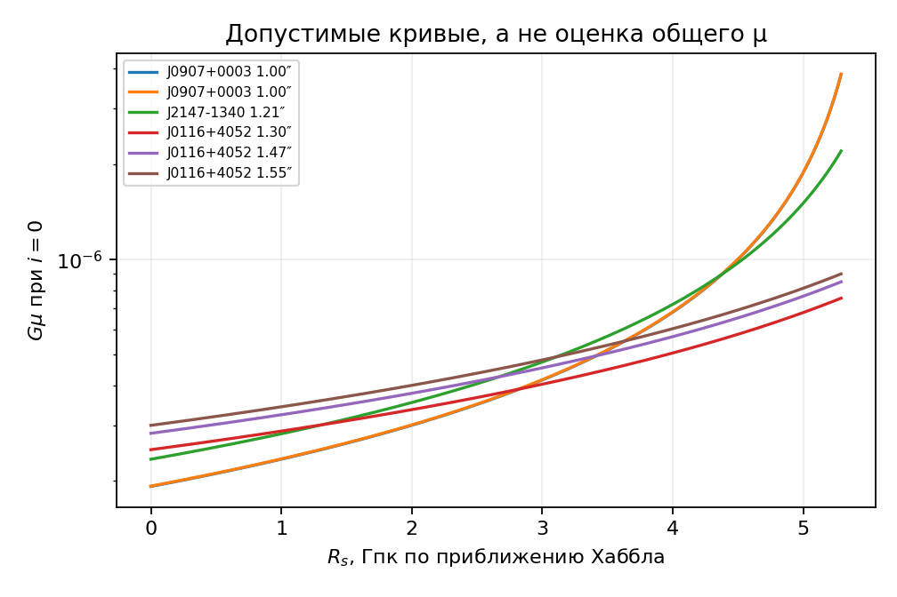

# Двойные квазары: качество подгонки и пределы вывода

Обработано **44 изображения квазаров** (CSL-1 анализируется отдельно). Cutout J0826+7002 и QSO1146+111B,C исключены из всех фотометрических фитов из-за неверной области вырезки; исходные FITS и библиографические записи сохранены. Gaussian PSF оценена по звёздоподобным источникам для 24, для остальных 20 использованы явно помеченные приближения: HST 0.10″, PS1 1.2″. В каждом изображении сравнивались один точечный источник, пара одинаковых PSF и пара независимых PSF; каждая пара подгонялась из 14 разных стартов с локальными ограничениями центров; для каждого кадра сохранены значения целевой функции по всем стартам и лучший найденный минимум. Для J0146–1133 отдельно подогнаны два точечных источника и экспоненциальная галактика Серсика с PSF-свёрткой. Шумовая модель учитывает shot noise и дисперсию фона, но игнорирует межпиксельные корреляции и несовершенство Gaussian PSF. Поэтому абсолютные $\chi^2_\nu$ и BIC служат предварительной диагностикой.

У **10/44** изображений многозапусковый поиск улучшил первый старт по $\chi^2$ более чем на 10; это подтверждает наличие существенных локальных минимумов, но не доказывает глобальность лучшего найденного решения.

По формальным критериям **18/44** одинаковых пар имеют $\chi^2_\nu<3$ и не упираются в край кадра. У **44** изображений независимая пара предпочтительнее одиночного PSF на $\Delta\mathrm{BIC}>10$. Только **9 кадров** (4 объектов; из них 1 с измеренной PSF) дополнительно имеют $\Delta\mathrm{BIC}_{equal-free}<10$. Это кадры для *дальнейшей проверки формы*, а не подтверждения струны.

## Формально прошедшие численные пороги

| Объект | PSF | Разделение, ″ | $\chi^2_\nu$ | $\Delta\mathrm{BIC}_{equal-free}$ |
|---|---|---:|---:|---:|
| J0116+4052 | assumed | 1.553 | 0.46 | -4.4 |
| J0116+4052 | assumed | 1.560 | 0.54 | -4.6 |
| J0116+4052 | assumed | 1.574 | 0.44 | -4.6 |
| J0116+4052 | assumed | 1.301 | 0.38 | -2.3 |
| J0116+4052 | assumed | 1.465 | 0.34 | -4.5 |
| J0907+0003 | assumed | 0.996 | 1.51 | 3.5 |
| J0907+0003 | assumed | 0.998 | 1.16 | -4.1 |
| J1540+4445 | measured | 2.630 | 1.23 | 0.2 |
| J2147-1340 | assumed | 1.214 | 2.48 | -6.1 |

Дублирующие фильтры одного объекта не являются независимыми подтверждениями. По опубликованной спектроскопии J0116+4052 является обычной галактической линзой; формальное прохождение им порога не повышает правдоподобие струнной гипотезы. Сами квазары могут иметь разную яркость; равный PSF — лишь одна проверяемая часть струнной гипотезы. На рисунке ниже показаны локальные оси, перпендикулярные разделению, без соединения разных объектов линией.

Для 8 объектов с обнаруженной парой и приемлемым fit осевая статистика равна $R=|\langle e^{2i\phi}\rangle|=0.152$. При моделировании 100 000 равномерных наборов получено $p=0.840$. Это исследовательский тест; отбор объектов и неопределённость угла требуют отдельной коррекции. По этим данным нельзя утверждать общий протяжённый сегмент струны.

## Красные смещения и расстояния по закону Хаббла

| Объект | $z$ | $D_H$, Гпк | Источник $z$ | Проверка идентификации |
|---|---:|---:|---|---|
| A2213–2652 | 1.2700 | 5.44 | [Cambridge Gravitationally Lensed Quasars](https://research.ast.cam.ac.uk/lensedquasars/indiv/A2213-2652.html) | каталог линз |
| DESJ0245–0556 | 1.5400 | 6.60 | [Lemon et al. 2020](https://academic.oup.com/mnras/article/494/3/3491/5801039) | спектроскопия линзы |
| J0116+4052 | 1.8500 | 7.92 | [Lemon et al. 2023](https://academic.oup.com/mnras/article/520/3/3305/6948349) | спектроскопия; обычная галактическая линза |
| J0127–1441 | 1.7600 | 7.54 | [Lemon et al. 2018](https://academic.oup.com/mnras/article/479/4/5060/4970775) | NIQ |
| J0146–1133 | 1.4400 | 6.17 | [Lemon et al. 2018](https://academic.oup.com/mnras/article/479/4/5060/4970775) | линза; галактика переднего плана |
| J0325-2232 | 1.3500 | 5.78 | [Lemon et al. 2023](https://academic.oup.com/mnras/article/520/3/3305/6948349) | спектры обеих компонент |
| J0749+2255 | 2.1700 | 9.29 | [Chen et al. 2023](https://arxiv.org/abs/2209.11249) | физическая двойная система |
| J0826+7002 | 1.6200 | 6.94 | [Lemon et al. 2023](https://academic.oup.com/mnras/article/520/3/3305/6948349) | cutout исключён из fit |
| J0907+0003 | 1.3000 | 5.57 | [Cambridge Gravitationally Lensed Quasars](https://research.ast.cam.ac.uk/lensedquasars/indiv/J0907%2B0003.html) | каталог линз |
| J0907+6224 | 1.8600 | 7.97 | [Lemon et al. 2023](https://academic.oup.com/mnras/article/520/3/3305/6948349) | спектроскопия |
| J0937+5835 | 2.1150 | 9.06 | [NED TAP; [HLC2023] 00272753A/B](https://ned.ipac.caltech.edu/tap/sync?QUERY=SELECT+prefname%2Cz%2Cz_bibcode+FROM+objdir+WHERE+CONTAINS%28POINT%28%27J2000%27%2Cra%2Cdec%29%2CCIRCLE%28%27J2000%27%2C144.3832%2C58.5906%2C0.001%29%29%3D1&LANG=ADQL&REQUEST=doQuery&FORMAT=csv) | координатная идентификация двух компонент; bibcode 2023MNRAS.520.3305L |
| J1515+3137 | 1.9700 | 8.44 | [Lemon et al. 2019](https://academic.oup.com/mnras/article/483/3/4242/5237725) | использованы исправленные координаты +31.627875 |
| J1518+4658 | 2.3600 | 10.11 | [Lemon et al. 2019](https://academic.oup.com/mnras/article/483/3/4242/5237725) | спектроскопия |
| J1524+4801 | 1.7000 | 7.28 | [Lemon et al. 2019](https://academic.oup.com/mnras/article/483/3/4242/5237725) | спектроскопия |
| J1540+4445 | 0.6100 | 2.61 | [Lemon et al. 2018](https://academic.oup.com/mnras/article/479/4/5060/4970775) | NIQ |
| J1616+1415 | 2.8800 | 12.33 | [Lemon et al. 2019](https://academic.oup.com/mnras/article/483/3/4242/5237725) | спектроскопия |
| J2015+0707 | 2.6039 | 11.15 | [LAMOST QSO DR6-9, Jin et al. 2023](https://vizier.cds.unistra.fr/viz-bin/VizieR-3?-source=J%2FApJS%2F265%2F25) | SDSS J201512.90+070659.7 в 1.7″; одна компонента |
| J2032–2358 | 1.6400 | 7.02 | [Lemon et al. 2019](https://academic.oup.com/mnras/article/483/3/4242/5237725) | NIQ |
| J2132+2603 | 2.2600 | 9.68 | [Lemon et al. 2019](https://academic.oup.com/mnras/article/483/3/4242/5237725) | спектроскопия |
| J2147-1340 | 1.3820 | 5.92 | [NED TAP; [LAA2023] J2147-1340 BG1/BG2](https://ned.ipac.caltech.edu/tap/sync?QUERY=SELECT+prefname%2Cz%2Cz_bibcode+FROM+objdir+WHERE+CONTAINS%28POINT%28%27J2000%27%2Cra%2Cdec%29%2CCIRCLE%28%27J2000%27%2C326.9957%2C-13.6772%2C0.001%29%29%3D1&LANG=ADQL&REQUEST=doQuery&FORMAT=csv) | координатная идентификация двух компонент; bibcode 2023MNRAS.520.3305L |
| J2250+2117 | 1.7300 | 7.41 | [Lemon et al. 2019](https://academic.oup.com/mnras/article/483/3/4242/5237725) | спектроскопия |
| J2316+0610 | 1.9550 | 8.37 | [Lemon et al. 2023](https://academic.oup.com/mnras/article/520/3/3305/6948349) | фон; foreground lens z=0.378 не использован |
| PSJ0417+3325 | 1.4100 | 6.04 | [Lemon et al. 2018](https://academic.oup.com/mnras/article/479/4/5060/4970775) | спектроскопия |
| QSO1146+111B,C | 1.0100 | 4.33 | [Green et al. 2004](https://hea-www.harvard.edu/~pgreen/Papers/postcos_04.pdf) | B/C; cutout исключён из fit |

Для двух записей `SDSS1128` и `SDSS111932` из исходной таблицы нет однозначных координат и полного имени; расстояния им не приписаны. Значения $D_H$ доступны также в машинной таблице `docs/quasar_distances_hubble.csv`. Красное смещение J2015+0707 относится к координатно совпавшему объекту на расстоянии 1.7″, поэтому принадлежность обеим компонентам не подтверждена спектроскопией.

## Разбор проблемных фитов

У J0116+4052, J0325-2232, J0907+0003 и J1518+4658 прежние решения с удалённым компонентом были локальными минимумами на соседних объектах. Теперь центры ограничены локальной апертурой; остатки и положения компонентов для **каждого** фильтра показаны в атласе. J0127–1441 остаётся почти неразрешённой парой: фит коллапсирует к одному PSF и не даёт надёжного разделения. У J0749+2255 и J2015+0707 потоки сильно различаются, и равная пара закономерно хуже независимой. Для J0146–1133 к паре добавлен передний профиль галактики; улучшение BIC проверяется отдельно, но остатки сохраняются. Критерии адекватности выше не превращают эти объекты в кандидатов на струну без эмпирической PSF и проверки морфологии.

## Что следует из параметров модели

Для наклонной прямой струны по [Bulygin et al. 2023](https://doi.org/10.1140/epjc/s10052-023-11994-x):

$$\theta_E=8\pi G\mu\left(1-\frac{R_s}{R_g}\right)\cos i$$

$$\left.\frac{\partial\theta_E}{\partial\xi}\right|_0=8\pi G\mu\sin i$$

Одна точечная пара определяет разделение и локальную ось, но **не определяет градиент** $\partial\theta_E/\partial\xi$: вдоль струны виден только один источник. Для всех 24 названных квазаров найдены опубликованные $z$, но у двух записей SDSS без численных координат идентификация остаётся открытой. Условная шкала расстояний вычислена **линейным законом Хаббла**: $D_H=cz/H_0$, где $c=299792.458$ км/с и $H_0=70$ км/с/Мпк. При $z\sim1$–3 это грубая экстраполяция низкокрасносмещённого приближения; $D_H$ здесь не называется собственным или светимостным расстоянием. Подстановка $D_H$ вместо $R_g$ даёт только условную шкалу. Из одной пары всё равно нельзя получить общие $G\mu$, $R_s$ и отдельные $i$. Даже при $i=0$ каждое измеренное разделение задаёт семейство $G\mu=\theta_E/[8\pi(1-R_s/R_g)]$ (с переводом угловых секунд в радианы); при $i>0$ необходимое $G\mu$ возрастает.

Следующий научный шаг — получить космологически согласованные расстояния и проверяемые изображения *протяжённых* источников либо нескольких источников на одной линии, измерить PSF в каждом фильтре, после чего оценивать совместную иерархическую модель $G\mu,R_s,i_j$.
