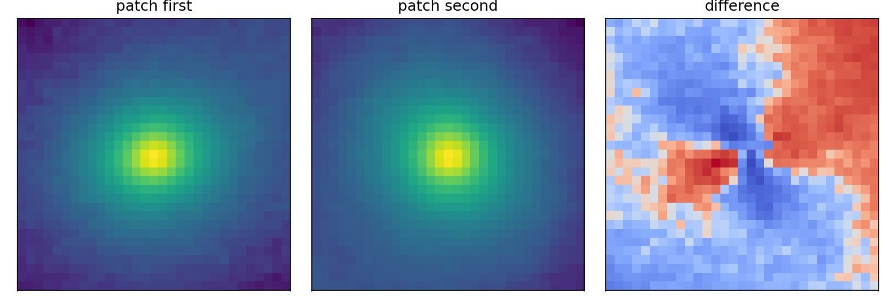
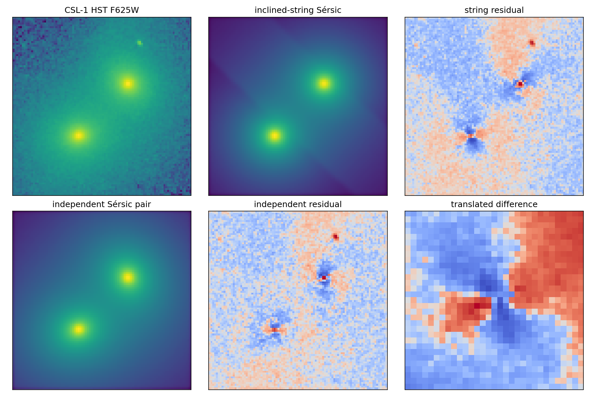

# CSL-1: проверка модели наклонной струны

Использован HST ACS F625W `j9cq01010_drc.fits`, экспозиция 5062 с, исходная шкала `ELECTRONS/S`. По координатам из `task.md` RA 185.8770833°, Dec −12.6491667° получен WCS crop с масштабом 0.0500″/пикс, пересчитанный в электроны, и PSF FWHM 0.139″ по соседним звёздам. Каталожная RA 185.875° направляла crop мимо пары; этот факт проверен непосредственно изображением. В fit взято поле 96×96 пикселей вокруг обеих галактик.

## Повторение сдвигового теста

[Agol, Hogan & Plotkin (2006)](https://arxiv.org/abs/astro-ph/0603838) проверяли **прямую струну с постоянным разделением**: два изображения одной галактики должны совпасть после переноса без поворота и изменения чётности. В статье сообщено $\chi^2_\nu=5.8$ в F625W и 5.0 в F775W для полосы 37×100 пикселей. Здесь воспроизведена идея теста на квадратных апертурах 31×31 пиксель с оптимизацией переноса двух компонент; получилось **$\chi^2_\nu=6.76$**. Число не обязано совпасть с 5.8: апертура, маска, drizzle, калибровка дисперсии и точная реализация отличаются. Разностное изображение содержит связные остатки.

Наши параметры сдвигового теста: $\Delta x=26.399$ пикселя, $\Delta y=27.879$ пикселя, длина сдвига **38.394 пикселя** или **1.920″**. В статье указан сдвиг 37.9 пикселя под углом −7.1° в их повёрнутой системе координат; длины близки, но углы, апертуры и методы оценки различны. Их три свободных параметра задают проекцию струны и ширину полосы; в нашей фиксированной 31×31 апертуре оптимизируются два компонента сдвига, поэтому это воспроизведение физического теста, а не буквальной статистической процедуры.

Направления главных осей по вторым моментам в апертуре получены 19.2° и 131.4° в пиксельных координатах, расхождение осей **67.8°**. Это согласуется с качественным выводом статьи о разных ориентациях, но наши углы нельзя напрямую приравнивать к опубликованным PA 51.7° и −2.6°: другая оценка формы и система отсчёта.

## Наклонная струна против двух галактик

### Параметры обеих моделей

Обе модели используют один HST crop, PSF FWHM 0.139″ и масштаб 0.050″/пиксель. В третьем столбце параметры двух галактик разделены точкой с запятой. Координаты и углы относятся к вырезанному массиву, а не к северу на небе. Нормировка $I_e$ — значение профиля Серсика при $r_e$ в электронной шкале изображения.

| Параметр | Одна галактика + наклонная струна | Две независимые галактики |
|---|---:|---:|
| Нормировка $I_e$, e на пиксель | 94.127 | 46.490; 68.537 |
| Эффективный радиус $r_e$, ″ | 1.348 | 2.224; 1.634 |
| Индекс Серсика $n$ | 5.254 | 6.000; 6.000 |
| Центр $(x_0,y_0)$, пиксель | (48.29; 45.66) | (35.06; 31.71); (61.50; 59.65) |
| Отношение осей $q$ | 0.947 | 0.831; 0.898 |
| Угол профиля в координатах кадра, ° | 87.44 | 70.92; 153.00 |
| Разделение $\theta_E$ при $\xi=0$, ″ | 1.9277 | — |
| Градиент $\partial\theta_E/\partial\xi$, ″/рад | 2000.000 | — |
| Позиционный угол струны в кадре, ° | 136.63 | — |
| Смещение струны, пиксель | -4.708 | — |
| Остаточный фон, e на пиксель | 10.090 | -6.245 |
| $\chi^2_\nu$; BIC | 2.856; 26393 | 1.953; 18107 |

Оба независимых индекса $n$ упёрлись в верхнюю границу 6: сами параметры формы и абсолютная статистическая значимость неустойчивы.

### Качество подгонки

Профиль одного источника Серсика, линзированный C++ моделью с линейным $\theta_E(\xi)$, сравнивался с суммой двух независимых профилей Серсика при одном измеренном Gaussian PSF. По 40 разным стартам лучшая струнная модель дала $\chi^2_\nu=2.856$, два независимых профиля — **1.953**. Разница $\mathrm{BIC}_{string}-\mathrm{BIC}_{two}=8286$ при данной диагональной шумовой модели сильно благоприятствует двум галактикам. Лучший свободный градиент 2000.0 arcsec/rad почти упёрся в предел ±2000; при ограничении ±10 arcsec/rad лучший $\chi^2_\nu=2.885$. Сильное различие формы остаётся.

| Ограничение градиента | Лучший градиент, ″/рад | $\chi^2_\nu$ | $\Delta\mathrm{BIC}$ относительно двух галактик |
|---|---:|---:|---:|
| ±2000 ″/рад (свободный тест) | 2000.000 | 2.856 | 8286 |
| ±10 ″/рад | 9.999 | 2.885 | 8555 |
| ±2 ″/рад (порядок физической границы) | 2.000 | 2.885 | 8556 |

В [модели 2023 года](https://doi.org/10.1140/epjc/s10052-023-11994-x) градиент в радианах на радиан равен $8\pi G\mu\sin i$; авторы отмечают, что при реалистичном дефицитном угле порядка $10^{-5}$ радиан влияние наклона на изображение мало. Свободный лучший градиент здесь соответствует 0.009696 рад/рад, почти в тысячу раз больше этого масштаба. Граница ±2 ″/рад соответствует $9.7\times10^{-6}$ рад/рад. Даже при таком физически более разумном ограничении два независимых профиля описывают этот кадр лучше. Формально из градиента следует $G\mu\geq |\partial\theta_E/\partial\xi|/(8\pi)$, если оба угла измерять в радианах. Свободный fit требует $G\mu\geq 0.00039$; это следствие нефизично большого градиента, а не измерение натяжения. Для CSL-1 [Agol et al.](https://arxiv.org/abs/astro-ph/0603838) приводят $z=0.463\pm0.008$: линейная шкала Хаббла при $H_0=70$ км/с/Мпк даёт $D_H\approx1.98$ Гпк. Даже подставив её вместо $R_g$, два наблюдаемых параметра $\theta_E$ и его градиент не определяют однозначно три неизвестные $G\mu$, $R_s$ и $i$.

При ограничении градиента до ±10 ″/рад остаётся следующая структура вычетов:

При ограничении до ±2 ″/рад картина также не приближается к шумовому вычету:

### Почему сдвиговый тест не исчерпывает струнную гипотезу

[Agol et al. (2006)](https://arxiv.org/abs/astro-ph/0603838) проверяли прямую струну с **постоянным** разделением двух копий. Их статистический вывод об исключении относится именно к этой нулевой гипотезе.

1. В сдвиговом тесте один перенос совмещает всю полоску изображения. В модели наклонной струны разделение зависит от координаты вдоль неё: $\theta_E(\xi)=\theta_E(0)+(\partial\theta_E/\partial\xi)_0\xi$. Поэтому реальная наклонная линза может дать ненулевой вычет при таком тесте. Само наличие вычета не исключает эту расширенную модель.
2. Авторы ссылались на разные позиционные углы главных осей как на аргумент против линзирования. Это сильный аргумент для прямой струны с постоянным сдвигом. Наклонная или изогнутая струна может менять локальную форму изофот, так что формулировка об исключении *любого* линзирования шире параметрического семейства, проверенного сдвигом.
3. Заявленная высокая сигма характеризует несогласие с моделью постоянного переноса при принятой шумовой модели. Она не является вероятностью для всех струнных геометрий и не заменяет прямое сравнение наклонной модели с моделью двух самостоятельных галактик. Именно такое сравнение дано выше — и оно тоже оказывается неблагоприятным для струнной трактовки.

Статья 2006 года **не фитировала профили Серсика**: их основной тест был непараметрической разностью после переноса. Параметрические модели Серсика выше — наше дополнительное сравнение, а не приписываемый авторам метод.

Исследование наклонной струны из [Bulygin et al. (2023)](https://doi.org/10.1140/epjc/s10052-023-11994-x) расширяет модель прямой струны, так что тест 2006 года сам по себе не является доказательством против *всех* конфигураций. Однако количественное сравнение с этой расширенной моделью на данном кадре также не поддержало линзу. Вывод статьи 2006 года не следует объявлять ошибочным: их тест корректен для явно сформулированной модели. Остатки двухпрофильного fit тоже структурны; они могут быть следами приливного взаимодействия, несовершенством Sérsic/PSF или соседними объектами. Для различения нужны двухцветные изображения, эмпирическая PSF, ковариация drizzle и моделирование приливных компонентов.

**Ограничение значимости:** $\chi^2$ и BIC рассчитаны с диагональной дисперсией; соседние пиксели HST drc коррелированы. Формальная разница очень велика, но точные вероятности исключения без ковариационной модели не вычислены. Это лучший найденный fit из 40 стартов, включая тёплый старт из ограниченной модели, а не математическое доказательство глобального минимума.
