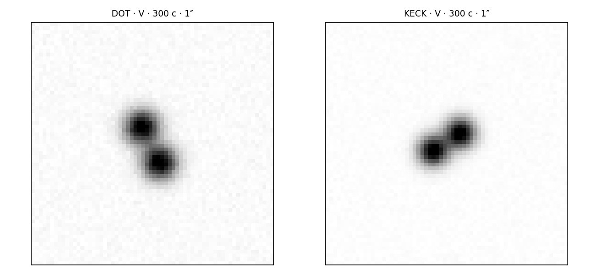
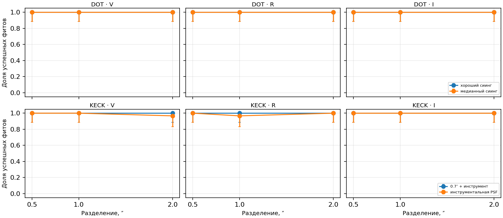
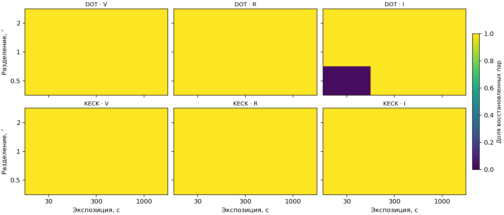

# DOT и Keck: восстановление двойных квазаров

Новый Monte Carlo использует **две точечные компоненты одинаковой яркости**, Gaussian PSF, небесный фон и масштабы пикселя из `params_DOT.json`/`params_KECK.json`. Для каждого сочетания телескопа, V/R/I фильтра, двух случаев PSF, экспозиции 30/300/1000 с и разделения 0.5/1/2″ создано 30 изображений (всего **108 комбинаций, 3240 изображений**). Оба источника условно имеют звёздную величину 20 в каждом фильтре. Поток источника выведен из указанной в JSON поверхностной яркости фона:

$$F_\star=\frac{B_\mathrm{sky}}{A_\mathrm{pix}}10^{0.4(\mu_\mathrm{sky}-m)}t_\mathrm{exp}$$

Ширина PSF учитывает дифракцию через $\mathrm{FWHM}_{eff}^2=\mathrm{FWHM}_{seeing}^2+(1.028\lambda/D)^2$ (углы в радианах) и заданное качество seeing. Шум содержит пуассоновские отсчёты источника+фона и выбранный для примера read noise 4 e−. Каждое изображение подгоняется тем же `real_fit.fit_model`, что применяется к реальным квазарам. Успех восстановления: независимая пара лучше одиночного PSF на $\Delta\mathrm{BIC}>10$, равная пара имеет $\chi^2_\nu<3$, ошибки разделения <20% и направления <15°. Для вероятности приведён 95% интервал Уилсона; при 30 опытах он остаётся широким. Здесь восстанавливаются разделение и направление **точечной пары**. Градиент разделения вдоль струны на одной паре не измеряется, поэтому эту долю нельзя интерпретировать как вероятность восстановления $G\mu$, $R_s$ или наклона $i$. Отдельный прогон расширенных галактик ниже проверяет подгонку полной модели.

Примеры синтетических кадров для двух выбранных комбинаций приведены ниже в спокойной чёрно-белой шкале: слева DOT/V с хорошим сиингом, справа Keck/V с суммой атмосферного сиинга 0.7″ и инструментальной PSF. Оба кадра моделируют 300 с и пару с разделением 1″. Остальные 3240 кадров представлены сводными статистиками.

Следующий график показывает, как при фиксированной экспозиции 300 с меняется доля верно восстановленных пар при увеличении углового разделения; отдельные кривые соответствуют телескопу, фильтру и принятой PSF.

Ниже шесть тепловых карт: верхний ряд DOT, нижний Keck; слева направо фильтры V, R, I. В каждой карте горизонтальная ось — экспозиция 30/300/1000 с, вертикальная — расстояние между компонентами 0.5/1/2″, цвет — доля восстановленных пар от 0 до 1. Для DOT на всех картах выбран медианный сиинг площадки (`site_median_seeing`), для Keck — атмосферный сиинг 0.7″ вместе с инструментальной PSF (`combined_seeing_0p7_plus_instrumental_center`). Полные результаты для обоих вариантов PSF приведены в таблице далее.

## Пример при 300 с и 1″

| Телескоп | Фильтр | PSF | Успех | Доля [95% ДИ] | Медиана $\chi^2_\nu$ |
|---|---|---|---:|---:|---:|
| DOT | V | медианный | 30/30 | 100% [89, 100] | 0.97 |
| DOT | V | хороший | 30/30 | 100% [89, 100] | 0.96 |
| DOT | R | медианный | 30/30 | 100% [89, 100] | 0.97 |
| DOT | R | хороший | 30/30 | 100% [89, 100] | 0.99 |
| DOT | I | медианный | 30/30 | 100% [89, 100] | 0.99 |
| DOT | I | хороший | 30/30 | 100% [89, 100] | 0.99 |
| KECK | V | 0.7″ + инструмент | 30/30 | 100% [89, 100] | 0.99 |
| KECK | V | инструмент | 30/30 | 100% [89, 100] | 1.00 |
| KECK | R | 0.7″ + инструмент | 30/30 | 100% [89, 100] | 1.00 |
| KECK | R | инструмент | 29/30 | 97% [83, 99] | 0.98 |
| KECK | I | 0.7″ + инструмент | 30/30 | 100% [89, 100] | 1.00 |
| KECK | I | инструмент | 30/30 | 100% [89, 100] | 0.98 |

Видимость улучшается при большем разделении и более узком PSF; экспозиция повышает S/N, но не снимает геометрическое смешение изображений. Фильтр меняет и фон, и принятую светимость источника; исходных измеренных цветов/сквозной функции не хватает для прогноза конкретного квазара. Модель не содержит wings PSF, соседних источников, насыщения, потерь от атмосферы, космических лучей и вариабельности. Поэтому числа характеризуют **условную эффективность алгоритма** при заявленных допущениях, а не гарантированную вероятность наблюдения струны.

Проверочный повторный прогон `result_telescope_rerun_20260924/` содержит по 50 симуляций расширенной галактики Серсика для DOT/V и Keck/V при 10, 31.6, 100, 316 и 1000 с. При 100 с формальный успех оптимизатора составляет 49/50 для DOT и 50/50 для Keck, но восстановление параметров в пределах 20% достигается лишь 8/50 в обоих случаях. Поэтому даже успешно завершённая оптимизация не означает физически верный fit. Архивные `result_DOT/` и `result_KECK/` тоже содержат точки по 50 симуляций **расширенных галактик Серсика**. Например, архивные DOT/U и Keck/V при 100 с дают формальный optimizer success 41/50 и 45/50, но восстановление параметров в 20% там лишь 5/50 для обеих точек. Эти массивы нельзя выдавать за прогноз для точечных квазаров. В C++ после рефакторинга координат смещение осталось нормальным к струне, поэтому численная карта эквивалентна старой в пределах округления; новое точечное Monte Carlo отвечает на отдельный наблюдательный вопрос.
