# Атлас фитов реальных квазаров

**44 изображения.** Для каждого показаны электроны после вычитания фона, модель равной пары, её вычет, маска пригодных пикселей, модель двух независимых точечных источников и её вычет. Все панели строятся из сохранённых лучших параметров фита; фиолетовый/жёлтый цвет в вычете соответствует отрицательным/положительным остаткам в единицах принятого шума. Значения χ² и BIC основаны на диагональной модели шума и поэтому являются диагностикой качества, а не точными вероятностями.

PSF `assumed` означает условное значение: такой fit нельзя считать проверкой линзирования. Большой выигрыш независимой пары над равной часто указывает на неравные потоки, сложную PSF или смешение с другими источниками.

## 01. A2213–2652 — hst_17308_b6_acs_wfc_f814w_jf56b6_drc.fits

PSF: **measured** (0.088″); χ²ν равной пары **162.96**, независимой **151.14**; ΔBIC(равная − независимая) **33491.6**; fit adequate: **False**. Исходный FITS: `hst_17308_b6_acs_wfc_f814w_jf56b6_drc.fits`.

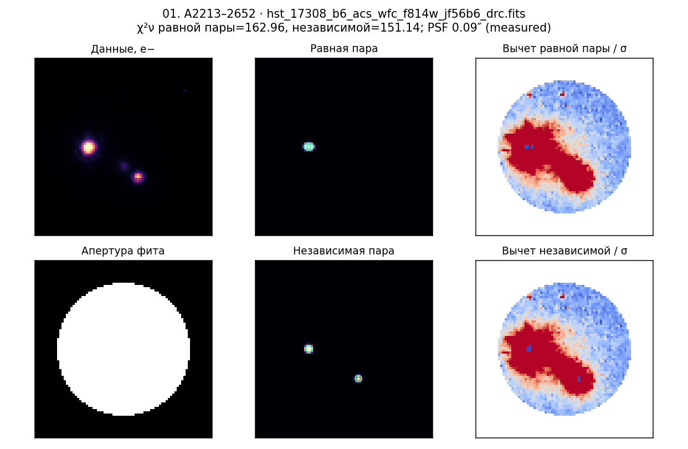

## 02. DESJ0245–0556 — J0245-0556_i_240px.fits

PSF: **measured** (1.302″); χ²ν равной пары **9.21**, независимой **9.09**; ΔBIC(равная − независимая) **64.6**; fit adequate: **False**. Исходный FITS: `J0245-0556_i_240px.fits`.

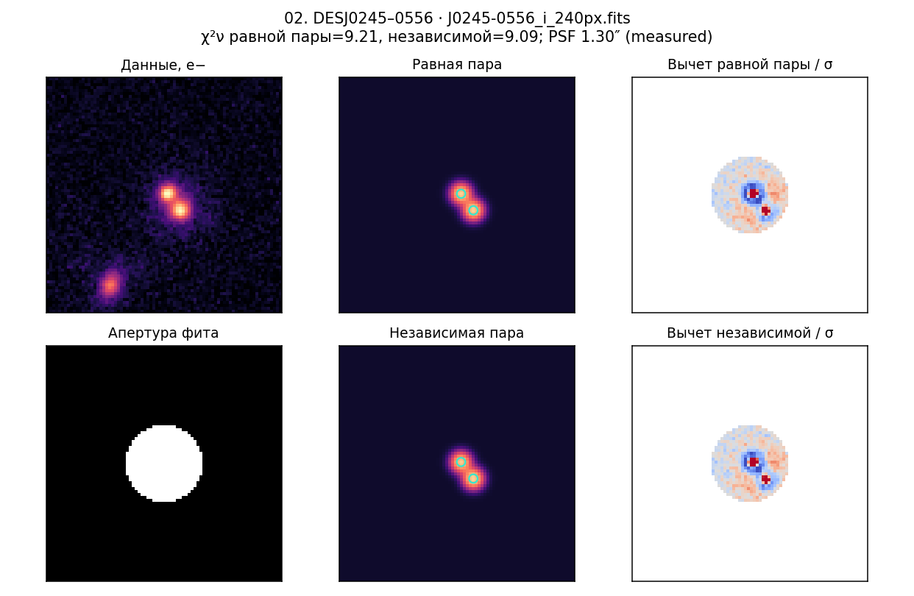

## 03. DESJ0245–0556 — J0245-0556_r_240px.fits

PSF: **assumed** (1.200″); χ²ν равной пары **3.23**, независимой **3.13**; ΔBIC(равная − независимая) **49.9**; fit adequate: **False**. Исходный FITS: `J0245-0556_r_240px.fits`.

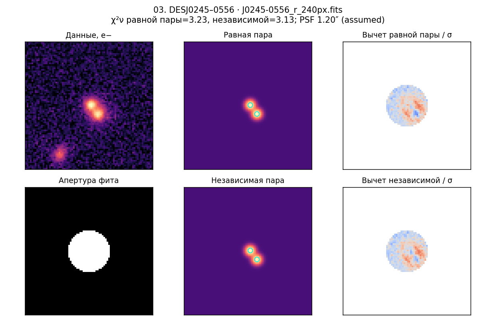

## 04. J0116+4052 — rings.v3.skycell.2161.028.stk.g.unconv.fits

PSF: **assumed** (1.200″); χ²ν равной пары **0.46**, независимой **0.46**; ΔBIC(равная − независимая) **-4.4**; fit adequate: **True**. Исходный FITS: `rings.v3.skycell.2161.028.stk.g.unconv.fits`.

## 05. J0116+4052 — rings.v3.skycell.2161.028.stk.i.unconv.fits

PSF: **assumed** (1.200″); χ²ν равной пары **0.54**, независимой **0.54**; ΔBIC(равная − независимая) **-4.6**; fit adequate: **True**. Исходный FITS: `rings.v3.skycell.2161.028.stk.i.unconv.fits`.

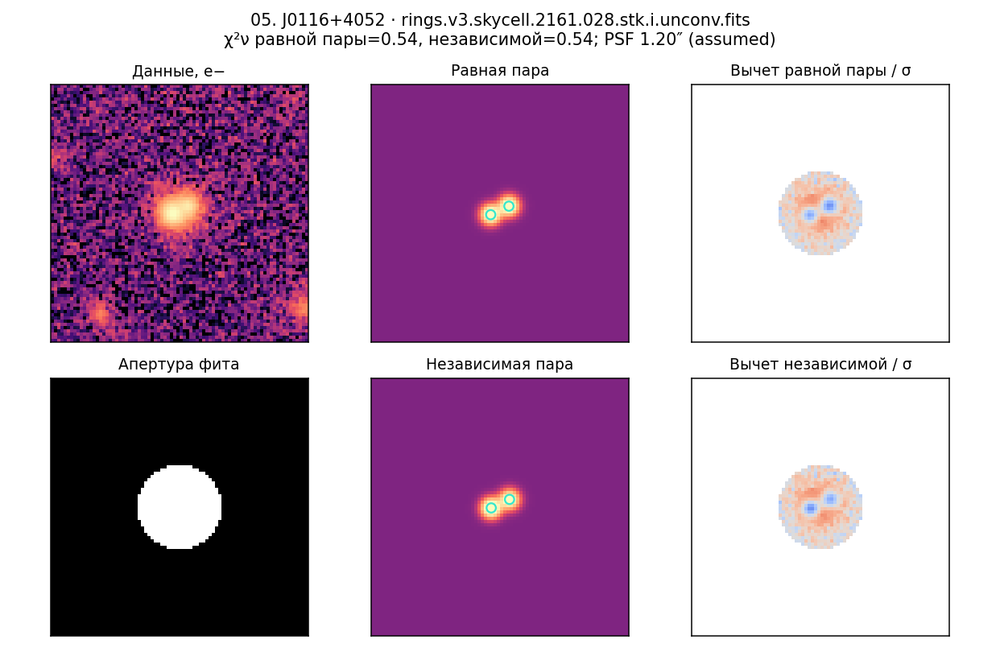

## 06. J0116+4052 — rings.v3.skycell.2161.028.stk.r.unconv.fits

PSF: **assumed** (1.200″); χ²ν равной пары **0.44**, независимой **0.43**; ΔBIC(равная − независимая) **-4.6**; fit adequate: **True**. Исходный FITS: `rings.v3.skycell.2161.028.stk.r.unconv.fits`.

## 07. J0116+4052 — rings.v3.skycell.2161.028.stk.y.unconv.fits

PSF: **assumed** (1.200″); χ²ν равной пары **0.38**, независимой **0.38**; ΔBIC(равная − независимая) **-2.3**; fit adequate: **True**. Исходный FITS: `rings.v3.skycell.2161.028.stk.y.unconv.fits`.

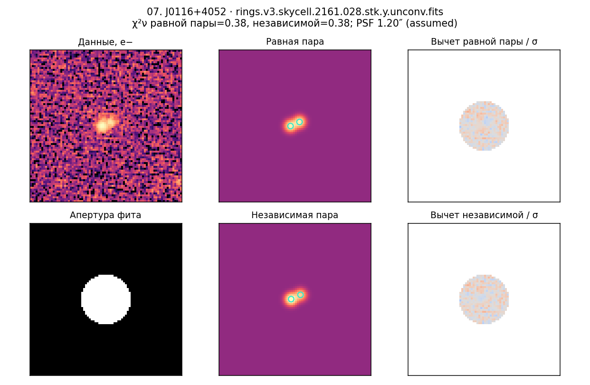

## 08. J0116+4052 — rings.v3.skycell.2161.028.stk.z.unconv.fits

PSF: **assumed** (1.200″); χ²ν равной пары **0.34**, независимой **0.34**; ΔBIC(равная − независимая) **-4.5**; fit adequate: **True**. Исходный FITS: `rings.v3.skycell.2161.028.stk.z.unconv.fits`.

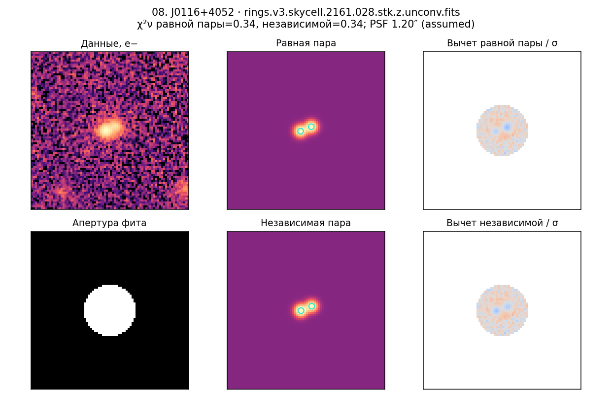

## 09. J0127–1441 — jf5622010_drc.fits

PSF: **measured** (0.104″); χ²ν равной пары **9.69**, независимой **8.62**; ΔBIC(равная − независимая) **3009.3**; fit adequate: **False**. Исходный FITS: `jf5622010_drc.fits`.

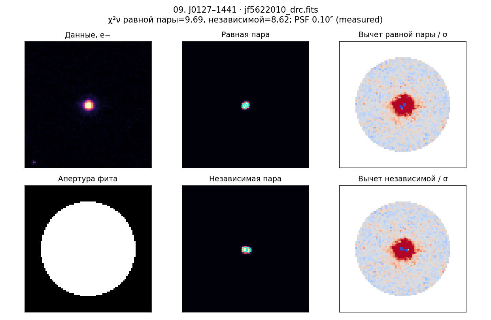

## 10. J0146–1133 — jf5628010_drc.fits

PSF: **measured** (0.099″); χ²ν равной пары **145.84**, независимой **144.85**; ΔBIC(равная − независимая) **2917.3**; fit adequate: **False**. Исходный FITS: `jf5628010_drc.fits`. Модель с галактикой: χ²ν **73.50**, ΔBIC(пара − пара+галактика) **201556.1**.

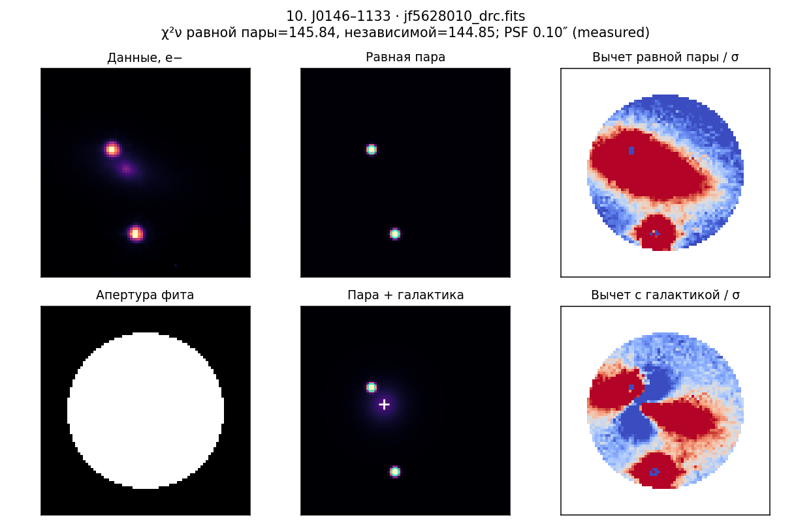

## 11. J0325-2232 — J0325-2232_i_240px.fits

PSF: **assumed** (1.200″); χ²ν равной пары **2.14**, независимой **1.78**; ΔBIC(равная − независимая) **183.7**; fit adequate: **True**. Исходный FITS: `J0325-2232_i_240px.fits`.

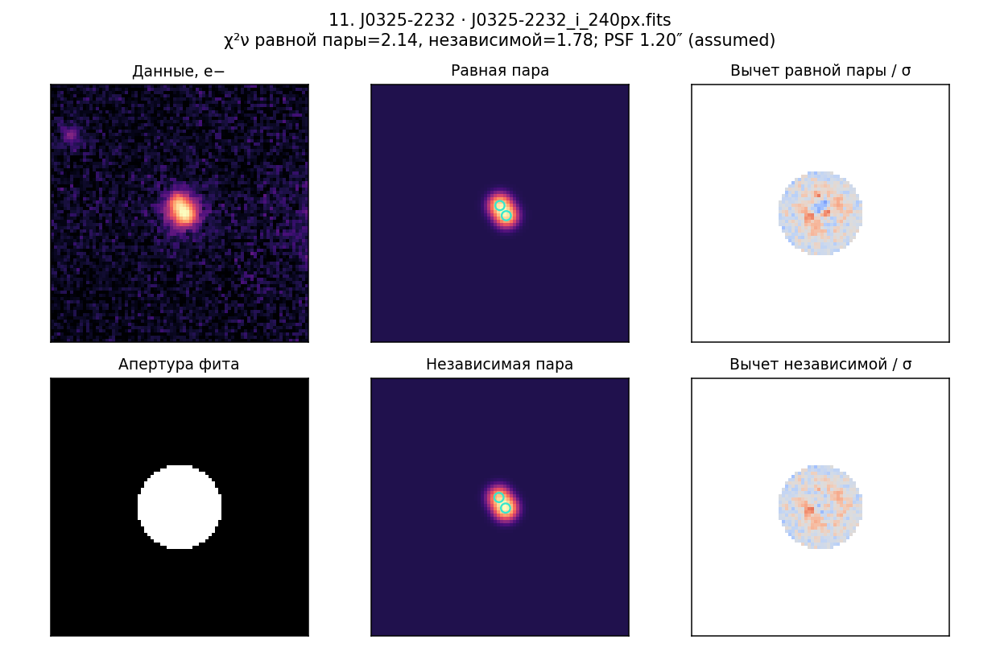

## 12. J0325-2232 — J0325-2232_r_240px.fits

PSF: **assumed** (1.200″); χ²ν равной пары **1.74**, независимой **1.51**; ΔBIC(равная − независимая) **120.4**; fit adequate: **True**. Исходный FITS: `J0325-2232_r_240px.fits`.

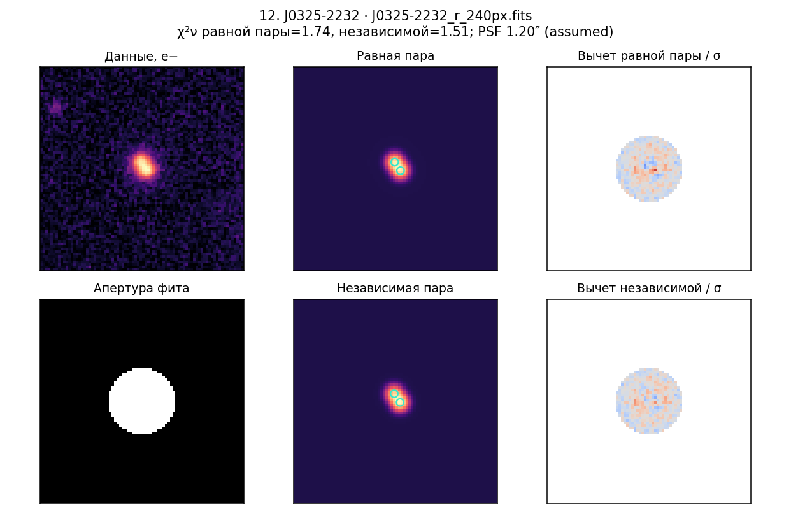

## 13. J0749+2255 — hst_skycell-p1791x05y15_wfc3_uvis_f475w_all_drc.fits

PSF: **assumed** (0.100″); χ²ν равной пары **11.02**, независимой **5.44**; ΔBIC(равная − независимая) **15758.6**; fit adequate: **False**. Исходный FITS: `hst_skycell-p1791x05y15_wfc3_uvis_f475w_all_drc.fits`.

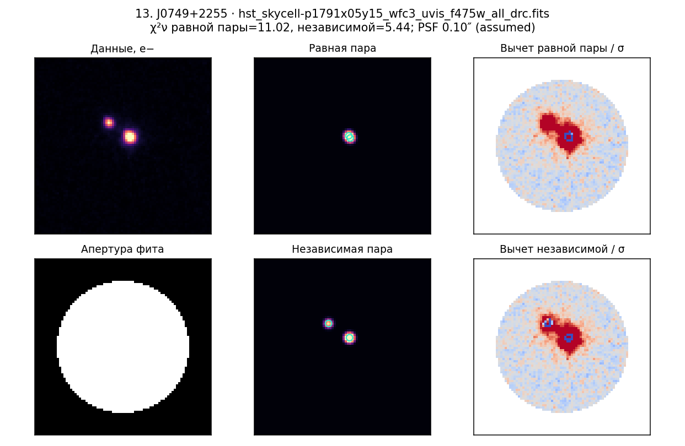

## 14. J0749+2255 — ie3b28010_drc.fits

PSF: **assumed** (0.100″); χ²ν равной пары **11.05**, независимой **5.36**; ΔBIC(равная − независимая) **16055.3**; fit adequate: **False**. Исходный FITS: `ie3b28010_drc.fits`.

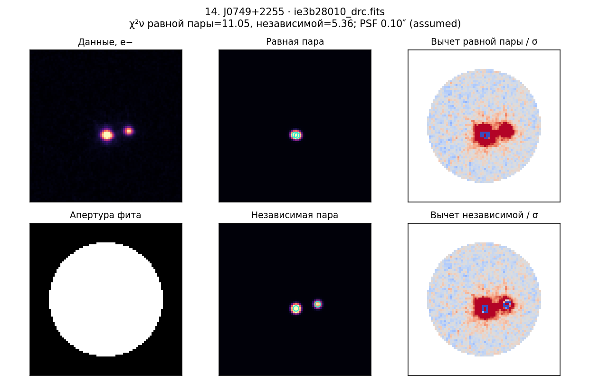

## 15. J0907+0003 — J0907+0003_i_240px.fits

PSF: **assumed** (1.200″); χ²ν равной пары **1.51**, независимой **1.50**; ΔBIC(равная − независимая) **3.5**; fit adequate: **True**. Исходный FITS: `J0907+0003_i_240px.fits`.

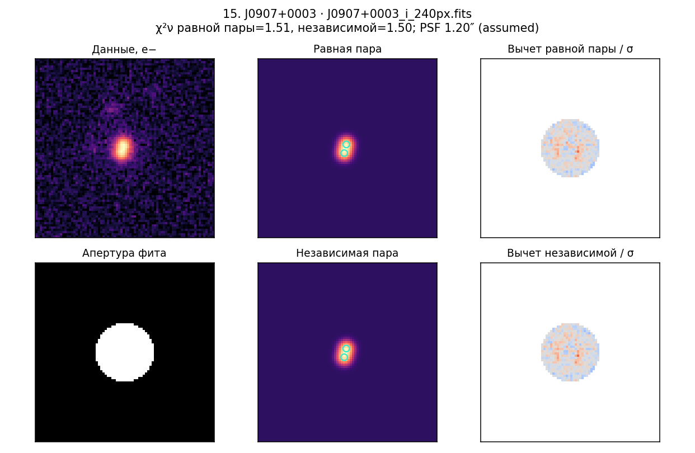

## 16. J0907+0003 — J0907+0003_r_240px.fits

PSF: **assumed** (1.200″); χ²ν равной пары **1.16**, независимой **1.16**; ΔBIC(равная − независимая) **-4.1**; fit adequate: **True**. Исходный FITS: `J0907+0003_r_240px.fits`.

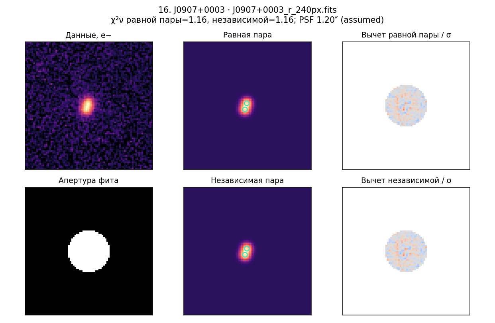

## 17. J0907+6224 — J0907+6224_i_240px.fits

PSF: **measured** (1.093″); χ²ν равной пары **11.89**, независимой **11.52**; ΔBIC(равная − независимая) **204.5**; fit adequate: **False**. Исходный FITS: `J0907+6224_i_240px.fits`.

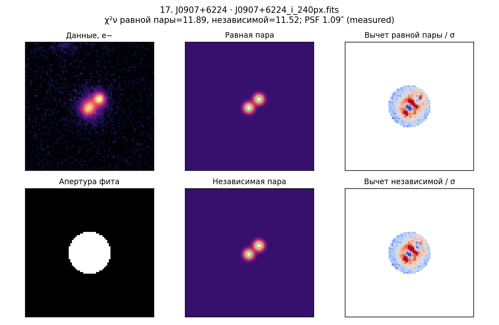

## 18. J0907+6224 — J0907+6224_r_240px.fits

PSF: **assumed** (1.200″); χ²ν равной пары **4.26**, независимой **3.74**; ΔBIC(равная − независимая) **277.0**; fit adequate: **False**. Исходный FITS: `J0907+6224_r_240px.fits`.

## 19. J0937+5835 — J0937+5835_i_240px.fits

PSF: **measured** (1.167″); χ²ν равной пары **1.63**, независимой **1.58**; ΔBIC(равная − независимая) **22.4**; fit adequate: **True**. Исходный FITS: `J0937+5835_i_240px.fits`.

## 20. J0937+5835 — J0937+5835_r_240px.fits

PSF: **measured** (1.370″); χ²ν равной пары **1.26**, независимой **1.11**; ΔBIC(равная − независимая) **74.0**; fit adequate: **True**. Исходный FITS: `J0937+5835_r_240px.fits`.

## 21. J1515+3137 — J1515+3137_i_240px.fits

PSF: **measured** (1.172″); χ²ν равной пары **2.54**, независимой **1.99**; ΔBIC(равная − независимая) **288.7**; fit adequate: **True**. Исходный FITS: `J1515+3137_i_240px.fits`.

## 22. J1515+3137 — J1515+3137_r_240px.fits

PSF: **assumed** (1.200″); χ²ν равной пары **2.12**, независимой **1.83**; ΔBIC(равная − независимая) **153.3**; fit adequate: **True**. Исходный FITS: `J1515+3137_r_240px.fits`.

## 23. J1518+4658 — J1518+4658_i_240px.fits

PSF: **measured** (0.930″); χ²ν равной пары **6.37**, независимой **4.65**; ΔBIC(равная − независимая) **920.0**; fit adequate: **False**. Исходный FITS: `J1518+4658_i_240px.fits`.

## 24. J1518+4658 — J1518+4658_r_240px.fits

PSF: **measured** (1.134″); χ²ν равной пары **4.19**, независимой **2.26**; ΔBIC(равная − независимая) **1023.4**; fit adequate: **False**. Исходный FITS: `J1518+4658_r_240px.fits`.

## 25. J1524+4801 — J1524+4801_i_240px.fits

PSF: **measured** (1.049″); χ²ν равной пары **9.49**, независимой **6.90**; ΔBIC(равная − независимая) **1384.6**; fit adequate: **False**. Исходный FITS: `J1524+4801_i_240px.fits`.

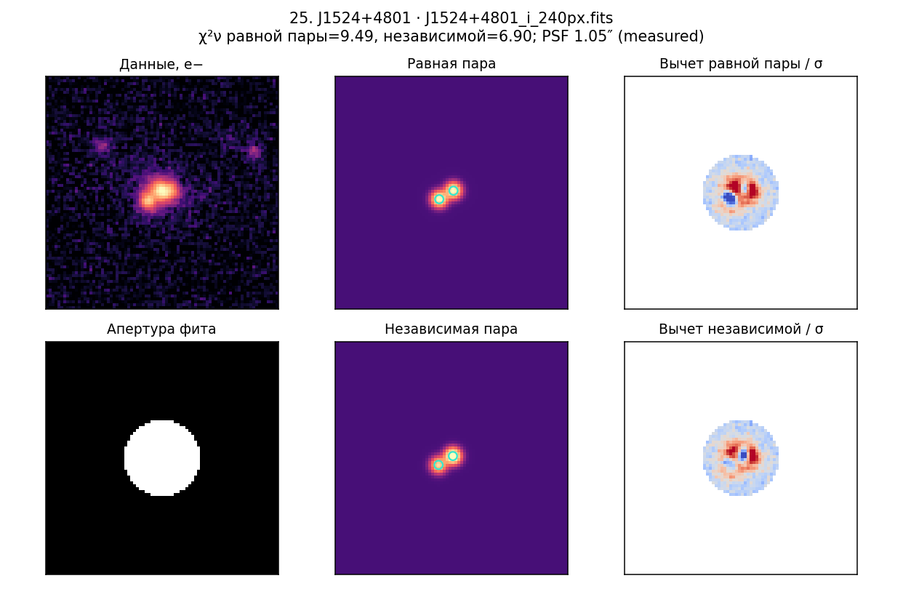

## 26. J1524+4801 — J1524+4801_r_240px.fits

PSF: **assumed** (1.200″); χ²ν равной пары **3.35**, независимой **2.48**; ΔBIC(равная − независимая) **465.3**; fit adequate: **False**. Исходный FITS: `J1524+4801_r_240px.fits`.

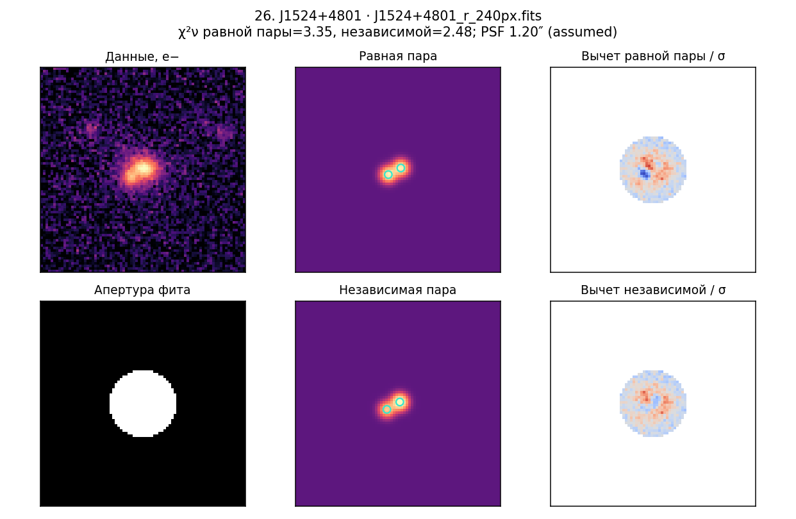

## 27. J1540+4445 — J1540+4445_i_240px.fits

PSF: **measured** (1.252″); χ²ν равной пары **1.42**, независимой **1.19**; ΔBIC(равная − независимая) **117.4**; fit adequate: **True**. Исходный FITS: `J1540+4445_i_240px.fits`.

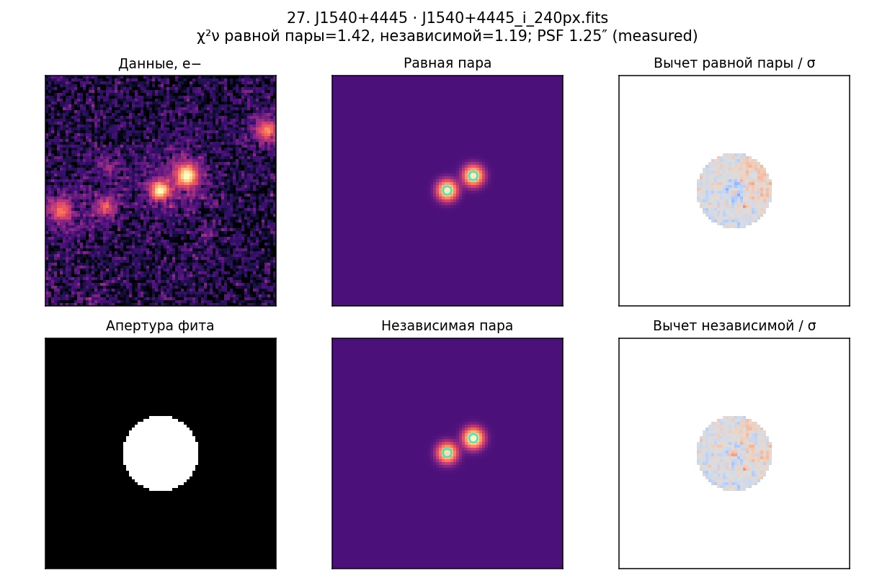

## 28. J1540+4445 — J1540+4445_r_240px.fits

PSF: **measured** (1.177″); χ²ν равной пары **1.23**, независимой **1.22**; ΔBIC(равная − независимая) **0.2**; fit adequate: **True**. Исходный FITS: `J1540+4445_r_240px.fits`.

## 29. J1616+1415 — J1616+1415_i_240px.fits

PSF: **measured** (1.014″); χ²ν равной пары **3.54**, независимой **1.88**; ΔBIC(равная − независимая) **879.7**; fit adequate: **False**. Исходный FITS: `J1616+1415_i_240px.fits`.

## 30. J1616+1415 — J1616+1415_r_240px.fits

PSF: **measured** (0.951″); χ²ν равной пары **5.16**, независимой **2.15**; ΔBIC(равная − независимая) **1601.1**; fit adequate: **False**. Исходный FITS: `J1616+1415_r_240px.fits`.

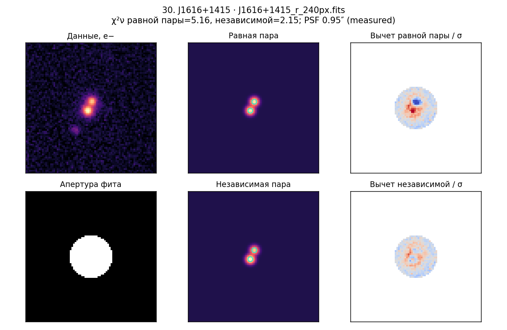

## 31. J2015+0707 — J2015+0707_i_240px.fits

PSF: **measured** (1.102″); χ²ν равной пары **6.66**, независимой **1.95**; ΔBIC(равная − независимая) **2510.3**; fit adequate: **False**. Исходный FITS: `J2015+0707_i_240px.fits`.

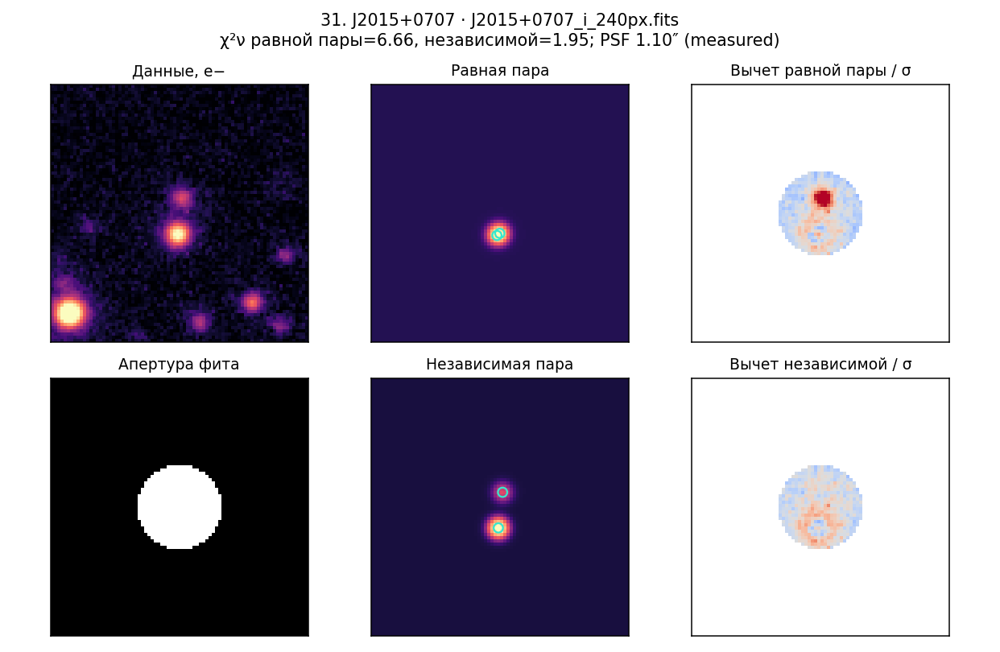

## 32. J2015+0707 — J2015+0707_r_240px.fits

PSF: **measured** (1.107″); χ²ν равной пары **5.15**, независимой **1.83**; ΔBIC(равная − независимая) **1769.1**; fit adequate: **False**. Исходный FITS: `J2015+0707_r_240px.fits`.

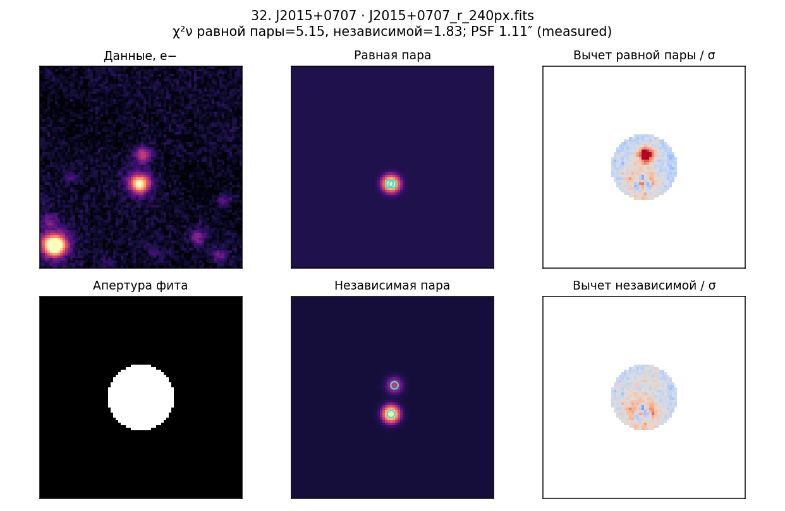

## 33. J2032–2358 — J2032-2358_i_240px.fits

PSF: **measured** (1.151″); χ²ν равной пары **9.83**, независимой **3.59**; ΔBIC(равная − независимая) **3327.3**; fit adequate: **False**. Исходный FITS: `J2032-2358_i_240px.fits`.

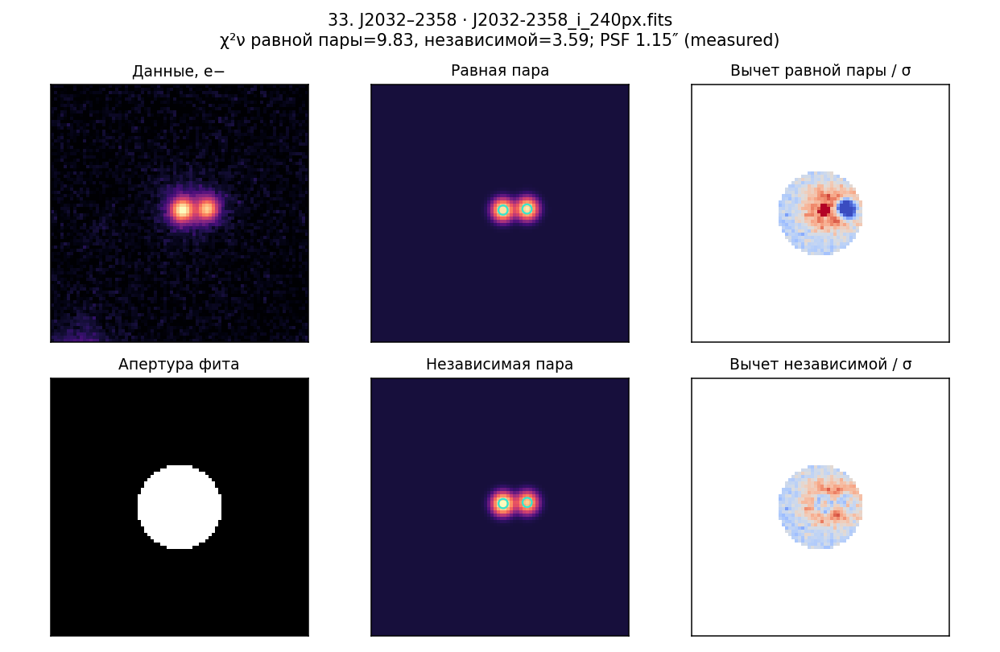

## 34. J2032–2358 — J2032-2358_r_240px.fits

PSF: **measured** (1.050″); χ²ν равной пары **4.27**, независимой **2.12**; ΔBIC(равная − независимая) **1146.1**; fit adequate: **False**. Исходный FITS: `J2032-2358_r_240px.fits`.

## 35. J2132+2603 — J2132+2603_i_240px.fits

PSF: **measured** (1.011″); χ²ν равной пары **4.04**, независимой **1.99**; ΔBIC(равная − независимая) **1093.4**; fit adequate: **False**. Исходный FITS: `J2132+2603_i_240px.fits`.

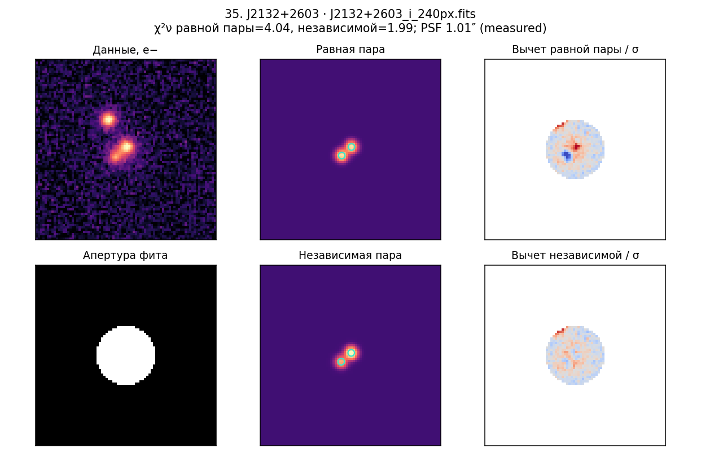

## 36. J2132+2603 — J2132+2603_r_240px.fits

PSF: **measured** (1.050″); χ²ν равной пары **6.94**, независимой **1.51**; ΔBIC(равная − независимая) **2896.1**; fit adequate: **False**. Исходный FITS: `J2132+2603_r_240px.fits`.

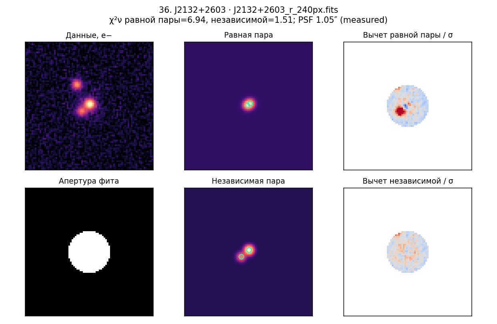

## 37. J2147-1340 — J2147-1340_i_240px.fits

PSF: **assumed** (1.200″); χ²ν равной пары **4.60**, независимой **4.60**; ΔBIC(равная − независимая) **-0.2**; fit adequate: **False**. Исходный FITS: `J2147-1340_i_240px.fits`.

## 38. J2147-1340 — J2147-1340_r_240px.fits

PSF: **assumed** (1.200″); χ²ν равной пары **2.48**, независимой **2.48**; ΔBIC(равная − независимая) **-6.1**; fit adequate: **True**. Исходный FITS: `J2147-1340_r_240px.fits`.

## 39. J2250+2117 — J2250+2117_i_240px.fits

PSF: **assumed** (1.200″); χ²ν равной пары **42.62**, независимой **8.43**; ΔBIC(равная − независимая) **18259.1**; fit adequate: **False**. Исходный FITS: `J2250+2117_i_240px.fits`.

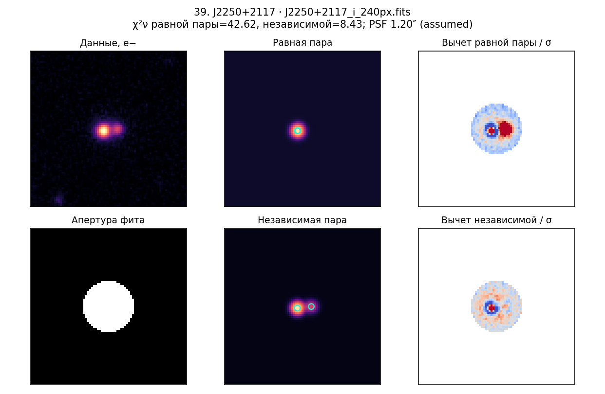

## 40. J2250+2117 — J2250+2117_r_240px.fits

PSF: **assumed** (1.200″); χ²ν равной пары **21.39**, независимой **5.32**; ΔBIC(равная − независимая) **8584.2**; fit adequate: **False**. Исходный FITS: `J2250+2117_r_240px.fits`.

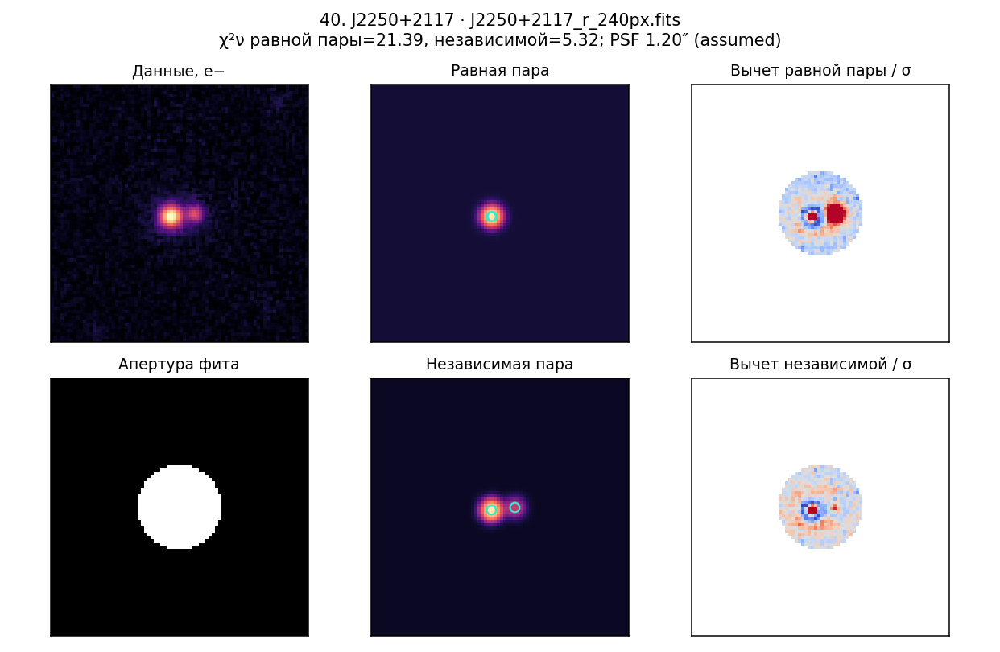

## 41. J2316+0610 — J2316+0610_i_240px.fits

PSF: **measured** (1.248″); χ²ν равной пары **2.31**, независимой **2.20**; ΔBIC(равная − независимая) **54.4**; fit adequate: **True**. Исходный FITS: `J2316+0610_i_240px.fits`.

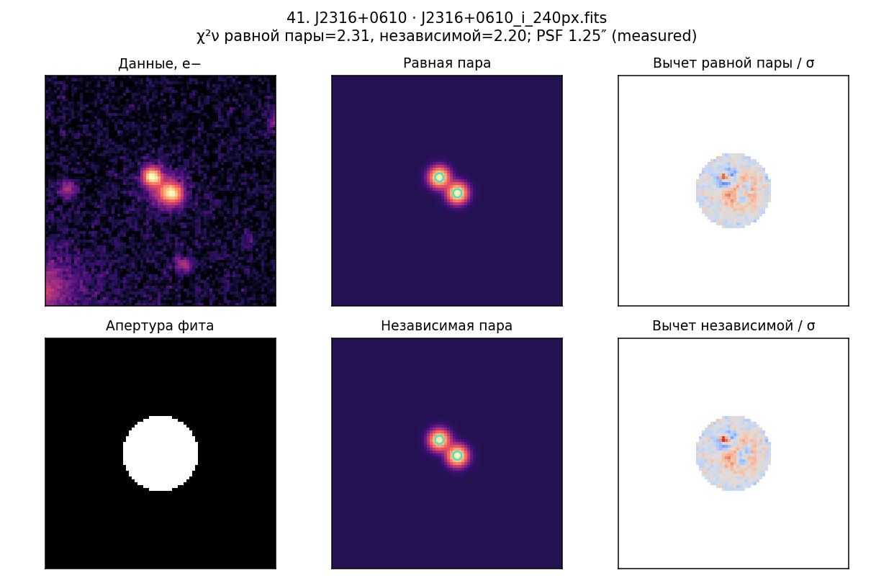

## 42. J2316+0610 — J2316+0610_r_240px.fits

PSF: **measured** (1.336″); χ²ν равной пары **1.49**, независимой **1.42**; ΔBIC(равная − независимая) **36.0**; fit adequate: **True**. Исходный FITS: `J2316+0610_r_240px.fits`.

## 43. PSJ0417+3325 — J0417+3325_i_240px.fits

PSF: **measured** (1.085″); χ²ν равной пары **12.40**, независимой **12.12**; ΔBIC(равная − независимая) **155.3**; fit adequate: **False**. Исходный FITS: `J0417+3325_i_240px.fits`.

## 44. PSJ0417+3325 — J0417+3325_r_240px.fits

PSF: **assumed** (1.200″); χ²ν равной пары **5.48**, независимой **5.41**; ΔBIC(равная − независимая) **39.9**; fit adequate: **False**. Исходный FITS: `J0417+3325_r_240px.fits`.

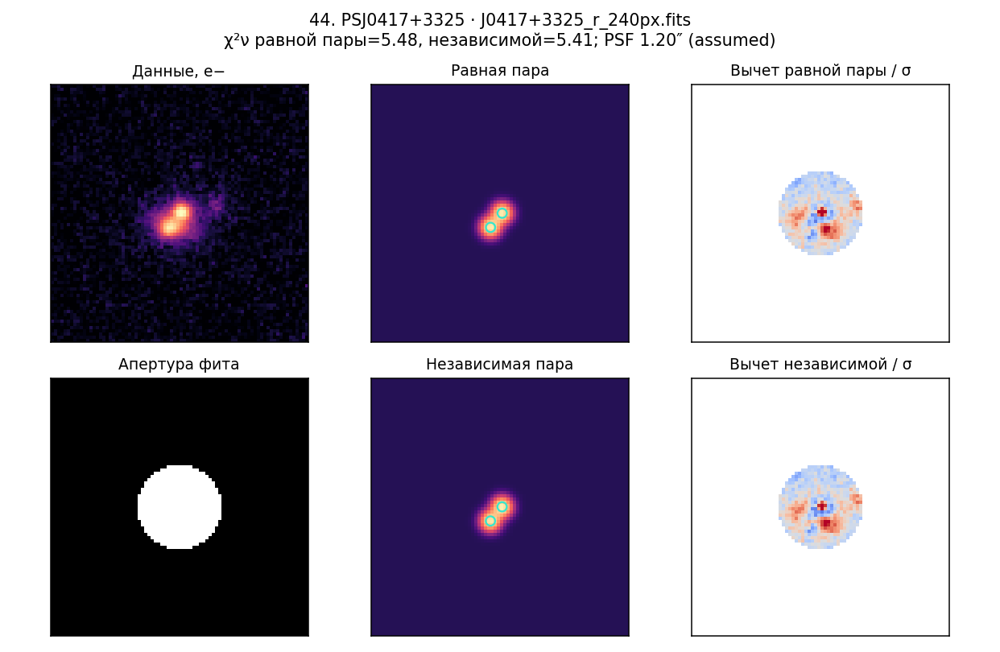

